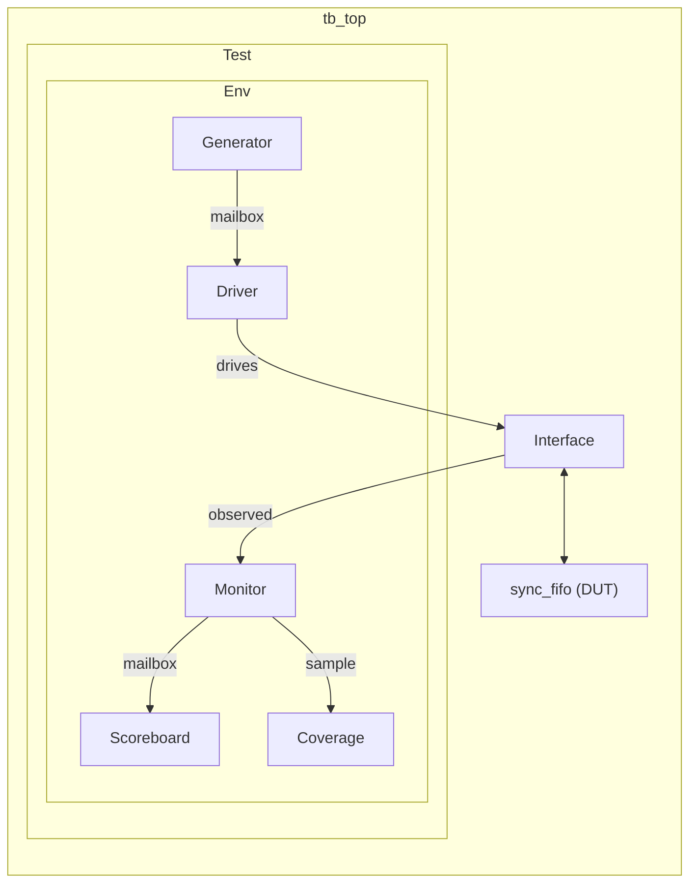
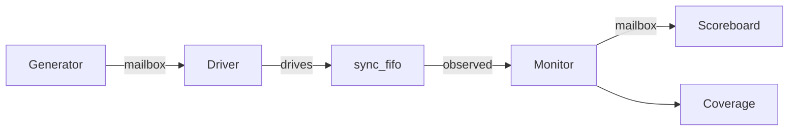
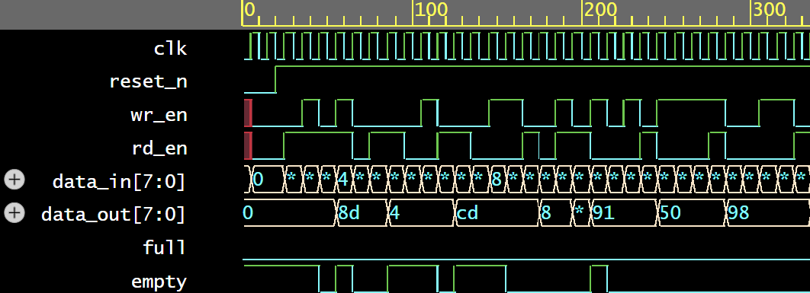

# SystemVerilog FIFO Verification Testbench


Custom (non-UVM) SystemVerilog testbench for a parameterized synchronous FIFO — constrained-random stimulus, self-checking scoreboard, and functional coverage.

## Data flow



## Design highlights

- The full/empty detection does not have a separate counter, but adds one additional "lap" bit to the read/write pointers, matching MSBs and equal lower bits means empty, mismatched MSB means full.
- The Driver goes through a clocking block, rather than signal assignment, to prevent racing the DUT on the same clock edge.
- The Monitor samples on `negedge`, half a cycle after the Driver/DUT on `posedge` -- the same race is prevented from the other end.
- The Scoreboard compares push/pop eligibility against *pre-cycle* full/empty, while checking the full/empty flags themselves *post-cycle* -- that's the thing that detects the simultaneous write-while-full-read case.

## Structure

```
rtl/
  sync_fifo.sv

tb/
  interface.sv
  transaction.sv
  generator.sv
  driver.sv
  monitor.sv
  scoreboard.sv
  coverage.sv
  environment.sv
  tb_top.sv
```

## Run

- Simulator: Cadence Xcelium 25.03 (EDA Playground)
- Design pane: `rtl/sync_fifo.sv`
- Testbench pane: `tb/*.sv`, included via `tb_top.sv`
- Compile: `-timescale 1ns/1ns -sysv`
- Run: `-access +rw -seed 12345 -coverage all` (fixed seed, so the results below are reproducible)

## Results

**Simulation:**
```
=================================
        SIMULATION REPORT        
  PASSED: 42    FAILED: 0     
=================================
```

**Coverage:**
```
=================================
 FUNCTIONAL COVERAGE: 90.00 %
=================================
```

Coverage involves `full`, `empty`, `wr_en`, and `rd_en`, as well as the intersection of `wr_en` and `rd_en` to prove that both read and write operations indeed took place. Present coverage stands at 90%. The rest is the coverage gap that resides in the most challenging individual states (`full` on 16-deep FIFO with purely random input is an extremely unlikely event) — addressing it would entail `dist`-based constraints on writing operations.

**Waveform in EPWave:**


